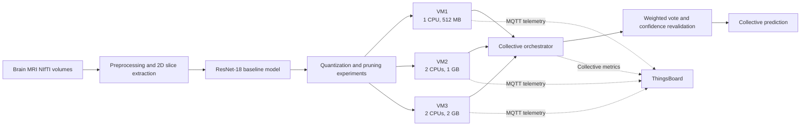

# Embedded Medical Inference and IoT Monitoring Platform

## Project Overview

This academic group project explores how a medical-image classification model can be optimized and deployed in simulated edge environments with limited compute and memory resources.

The platform prepares brain MRI data, trains a binary ResNet-18 classifier, compares model-compression techniques, deploys inference services to three constrained Docker nodes, and combines their predictions through a collective inference service. Each node publishes inference and resource telemetry to ThingsBoard through MQTT for operational monitoring.

This project is an experimental academic demonstration and is not a clinical diagnostic system.

## Architecture

The three Docker services represent edge devices with progressively larger resource budgets. A Python orchestrator distributes inference requests, aggregates responses, and can revalidate low-confidence collective decisions. ThingsBoard receives operational telemetry and collective metrics for dashboarding and alerts.

## Technology Stack

| Project Component | Technologies | Purpose |
| --- | --- | --- |
| Data preparation | Python, NiBabel, NumPy, Pandas | Inspect NIfTI MRI volumes, normalize and resize data, create reproducible metadata, and extract 2D training slices. |
| Deep learning | PyTorch, Torchvision, ResNet-18 | Train and evaluate a binary classifier adapted for single-channel medical-image slices. |
| Model optimization | Dynamic quantization, static PTQ, QAT, weight-only and mixed-precision quantization, unstructured/structured/magnitude pruning | Compare model size, latency, accuracy, and resource trade-offs. |
| Constrained deployment | Docker, Docker Compose, Flask, Psutil | Run three HTTP inference services with explicit CPU and memory limits and collect resource metrics. |
| Collective inference | Python | Route requests across nodes, combine predictions with weighted voting, perform confidence-based revalidation, and support basic load-aware routing. |
| IoT monitoring | MQTT, Paho MQTT, ThingsBoard Community Edition | Publish prediction, confidence, latency, CPU, RAM, optimization, and collective-decision telemetry. |
| Analysis and evaluation | Scikit-learn, Matplotlib | Calculate classification metrics, benchmark inference, compare optimization techniques, and generate result artifacts. |

## Data Flow

1. Brain MRI volumes in NIfTI format are inspected, normalized, resized, and converted into 2D slices.
2. The dataset is split into train, validation, and test sets using subject-aware metadata.
3. A single-channel ResNet-18 baseline model is trained and evaluated for binary classification.
4. Eight optimization variants are produced: five quantization methods and three pruning methods.
5. The variants are benchmarked for size, accuracy, latency, CPU usage, and memory consumption.
6. The selected model configuration is served by three Docker-based virtual nodes with different CPU and RAM constraints.
7. The collective orchestrator gathers node predictions, applies weighted voting, and triggers revalidation when collective confidence is low.
8. Each node and the orchestrator publish telemetry through MQTT to ThingsBoard for real-time dashboards and alerts.

## Baseline Results

The repository includes the following baseline evaluation results on the test set:

| Metric | Result |
| --- | --- |
| Accuracy | 98.70% |
| Precision | 100.00% |
| Recall | 97.46% |
| F1-score | 98.71% |

Detailed optimization, deployment, and collective-inference outputs are retained in the `results` directory.

## Project Scope

- Three constrained Docker nodes model different edge-device resource profiles.
- Five quantization and three pruning techniques are implemented for comparison.
- Each inference service exposes an HTTP endpoint and emits MQTT telemetry after inference.
- ThingsBoard dashboards are designed to monitor predictions, confidence, latency, CPU, RAM, technique comparisons, and collective-inference indicators.
- The project is implemented by a group as part of the Master Data Science course on embedded systems and connected objects.
